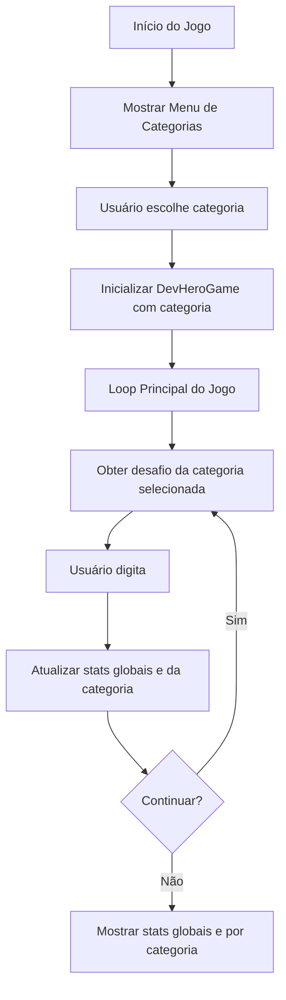

# Modo de Prática por Categoria

## Objetivo

Permitir que o usuário escolha uma categoria específica para praticar (Python, JavaScript, Errors, Memes, Keywords) através de um menu no início do jogo, mantendo estatísticas globais e separadas por categoria.

## Arquitetura



## Mudanças Necessárias

### 1. Modificar `game.py` - Classe DevHeroGame

**Adicionar:**

- Atributo `category` para armazenar categoria atual
- Atributo `category_stats` (dict) para estatísticas por categoria
- Método `set_category(category)` para definir categoria
- Modificar `get_challenge()` para usar categoria selecionada
- Modificar `finish_round()` para atualizar stats da categoria
- Novo método `get_category_stats(category)` para retornar stats de uma categoria
- Novo método `get_all_category_stats()` para retornar todas as stats por categoria

**Arquivo:** [`game.py`](game.py)

### 2. Modificar `codes.py`

**Adicionar:**

- Função `get_available_categories()` que retorna lista de categorias disponíveis
- Função `get_category_display_name(category)` para nomes amigáveis (ex: 'python' -> 'Python Snippets')

**Arquivo:** [`codes.py`](codes.py)

### 3. Modificar `main.py`

**Adicionar:**

- Função `show_category_menu()` que exibe menu de categorias
- Função `select_category()` que lida com seleção do usuário
- Função `print_category_stats(game)` para mostrar estatísticas por categoria
- Modificar `main()` para chamar menu de categorias antes do loop
- Atualizar `print_game_stats()` para incluir stats por categoria

**Arquivo:** [`main.py`](main.py)

## Estrutura de Dados

### Estatísticas por Categoria

```python
category_stats = {
    'python': {
        'rounds': 0,
        'total_wpm': 0.0,
        'total_accuracy': 0.0,
        'best_wpm': 0.0
    },
    'javascript': { ... },
    # etc
}
```

## Fluxo de Execução

1. **Início do jogo:**

   - Mostrar header
   - Mostrar menu de categorias
   - Usuário escolhe categoria (ou 'all' para misto)
   - Inicializar `DevHeroGame` com categoria selecionada

2. **Durante o jogo:**

   - Obter desafios apenas da categoria selecionada
   - Atualizar stats globais e da categoria específica

3. **Ao final:**

   - Mostrar estatísticas globais
   - Mostrar estatísticas por categoria (apenas categorias usadas)

## Detalhes de Implementação

### Menu de Categorias

- Opções: Python, JavaScript, Errors, Memes, Keywords, All (mixed)
- Validação de entrada
- Permite voltar/alterar escolha

### Estatísticas

- Stats globais: continuam funcionando como antes
- Stats por categoria: apenas categorias que foram jogadas aparecem
- Formato: "Python: 5 rounds, 45.2 WPM avg, 95.5% accuracy"

### Compatibilidade

- Manter comportamento padrão se categoria não for especificada (usar 'all')
- Função `get_random_challenge()` continua funcionando para compatibilidade